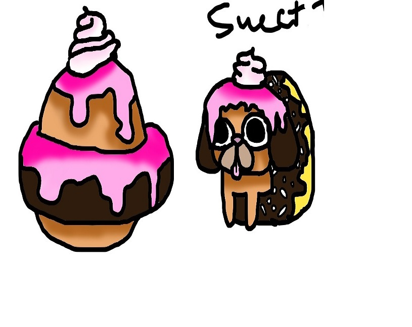
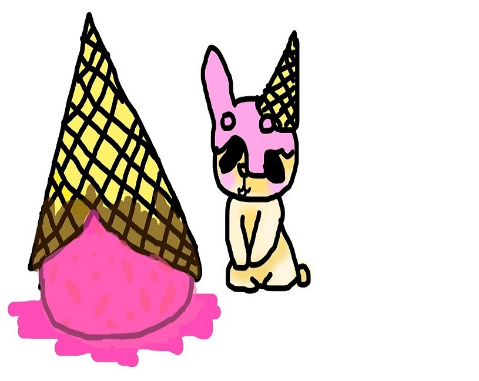
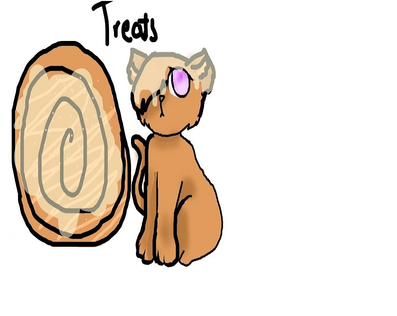
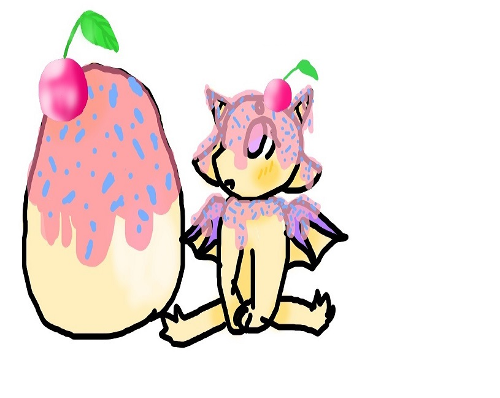
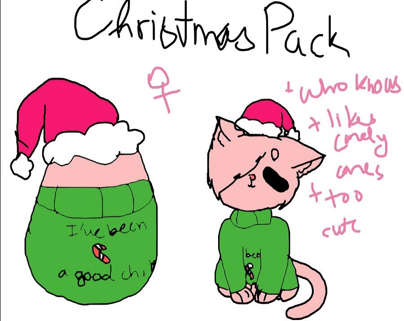
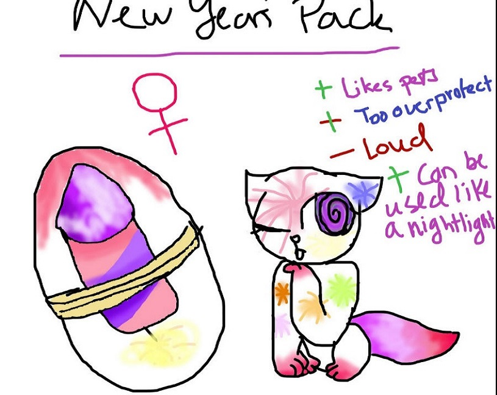
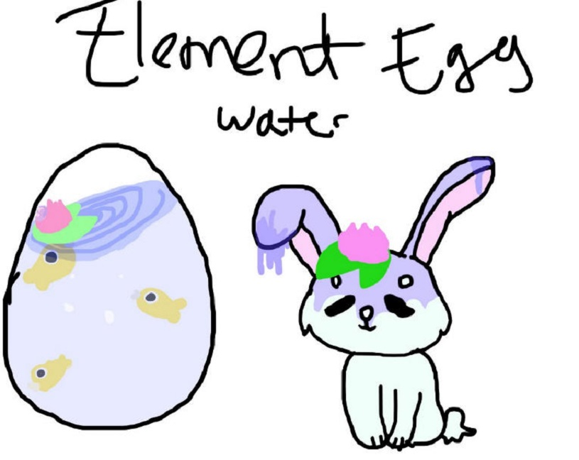

# Team mumbers:

# Projective
Ideas of using Ethereum Smart Contract project
1. Tracking credit of training program
2. create digital surprising eggs -- which my daughters love most :) . Tracking dinasour/Ester/surprise eggs generation, dinasour breeding on DAPP

# Reference information
Logon website : http://lemonthy.ca and choose Ropsten metamask Ethereum test network, you can create/purchase for free on new Wonder eggs now!

## step for setup test enviroment for contracts.

## prerequest:
* for Install & run TestRPC: $ npm install -g ethereumjs-testrpc
* $ testrpc
* for Install Truffle: $ npm install –g truffle
* $ mkdir TruffleTestProject
* $ cd TruffleTestProject
* truffle unbox webpack
* npm install -g gulp bower (if you first time install gulp with -g, after this step you may want to exit cmd and reopen cmd to make path work with gulp)
* clone or download Github
* unzip the downloade github and copy contracts folder , app folder to TruffleTestProject and overwrite
* cd contracts
* truffle compile
* truffle migrate
* open testrpc or geth console in new window
* in new window type : npm run dev
* open localhost:8080 base on npm run dev
* npm run build
* npm install gulp bower
* gulp          
* gulp watch
* gulp will launch a browser window that opens the dashboard, alternatively it will be accessible at http://localhost:8000/

## step for create or purchase a new wonder egg puppy on block chain network:

Logon website : http://lemonthy.ca and choose Ropsten metamask Ethereum test network, you can create/purchase for free on new Wonder eggs now!
1. open chrome and intall metamask.
Wanna play?
You’ll need a safe place to store all of your adorable wonder egg puppies! The perfect place is in a secure wallet like MetaMask. This will also act as your login to the game (no extra password needed).
Install MetaMask
you will need to install MetaMask, a digital wallet. You will need to put money in it to make your first purchase.
Note: A digital wallet like MetaMask acts like a bank account—treat it with respect and make sure you don’t forget your password or the seed words.
Occasionally the metemask page displays a lock screen. This happens because MetaMask locks your account after a certain period of time automatically. To unlock simply click on the MetaMask extension and type in your password.
2. open http://lemonthy.ca and choose Ropsten metamask Ethereum test network on metamask, you can create/purchase for free on new Wonder eggs for free now! 
 
 

 
 
 
 
 

 

As a new user log on, you can only see the youngest wonder egg descrption and currently total wonder egg puppy on block chain.
Please feel free to create your own wonder egg /puppy because it is free now.
 

Roadmap:

Later update of price options: 
intial price for smart contract:
chicken egg -- 1 cent -- 1 Wonder Coin
duck egg -- 5 cents  -- 5 Wonder Coin
frog egg -- 1 dime  -- 10 Wonder Coin
goose egg --1 quarter --25 Wonder Coin
Carassius auratus -- 1 dollars --100 Wonder Coin
Turtle egg -- 2 dollars --200 Wonder Coin 
Snake egg -- 5 dollars -- 500 Wonder Coin
Crocodile egg --10 dollars -- 1000 Wonder Coin 
dove egg -- 20 Dollars -- 2000 Wonder Coin
Dinosaur egg-- 50 Dollars -- 5000 Wonder Coin
Ester egg -- 100 Dollars -- 10000 Wonder Coin
surprise egg -- randome price > 20000 Wonder Coin

hatch rules for smart contract 1: 
Chichen egg can be hatched by hens(1 DAY 1 egg, put together backend), or distance of walk execsise(1 KM per egg).
Dinosaur egg can be hatched by Dinosaur(1 DAY 1 egg, put together backend), or distance of walk execsise(1 KM per egg).
Ester egg distance of walk execsise(1 KM per egg).
surprise egg distance of walk execsise(1 KM per egg).

evolve rules for smart contract 1: 

 
Dinosaur egg + Dinosaur can evolve to new type Dinosaur 
Ester egg + Easter Bunny can evolve to new type Bunny
surprise egg + catty/doggy can evolve to new type doggy/catty
