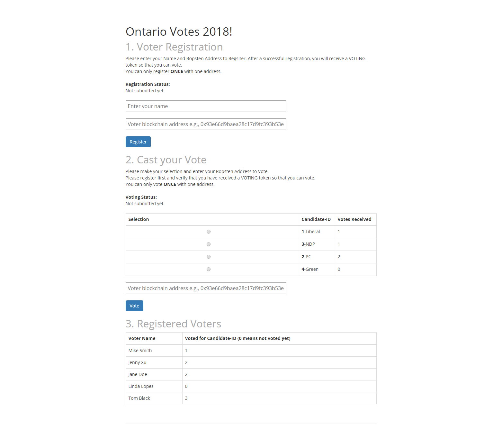

# A Simple Voting Dapp based on Tokens

## Overview
This is a simple voting Dapp.  It uses a smart contract to create a voting token and use it as a voting ballot.   

## Usage
The process works like this:
1. Step 1: Voter registration.
    1. Input the full name
    1. Input a blockchain network address.
    1. Click "Register" button and wait for "Registration Status:" to display "Completed".
    1. Check the section 3. Registered Voters to see the voter name showing up with "Voted for Candidate-ID" showing as 0, which means not voted yet.
    1. Each address can only register once.  In real situation, more identity information would be required, like Driver License Number, SIN, employee number etc.
1. If the voter registers successfully. the voter will receive one VOTING token. The voter can check the MetaMask wallet to verify.
1. Step 2: Casting your Vote. Then the voter can proceed to vote by
    1. Select the Candidate from the list
    1. Provide the same blockchain address that is used for registration.
    1. Click "Vote" button and wait for the "Voting Status:" to display "Completed".
    1. The VOTING token received from registration will be sent back to the contract ower upon voting. It serves as the voting ballot, also makes sure that one voter can only vote once. 
    1. Check Section 2 and see that the "Votes Received" for the voted Candidate-ID should be increased by 1
    1. Check section 3 Registered Voters to see that the "Voted for Candidate-ID" should be updated to show the voted Candidate-ID for that voter.
1. All voting results are displayed to show who voted for which candidate.  It is easier to test and verify this way.  It is simple to make the voting anonymouse. 

## Team Members
Hong Yu

## About the Contract
Fashioned after the token example in the class, the voting contract, VotingToken.sol,  is built on top of the StandardToken to issue the VOTING ERC20 tokens as the voting ballot.  It also use the Truffle webpack as the base for the frontend.

The VotingToken contract has been deployed to Ropsten testing network with address: 0x8a41daf6c5e38c091380ce7ae507463fea439e9a

The contract was initiated with the following parameter:
```
1000000, "Voting Token", "VOTING", ["placeholder","Liberal","PC","NDP","Green"]
```
Please note that the first element in the candidate array "placeholder" is not used as a candidate.  It is placed there to take the position of "0" in the array to avoid confusion with the initial default value of 0 for voter's selection of candidate-ID.

Here is how it looks like during testing:

